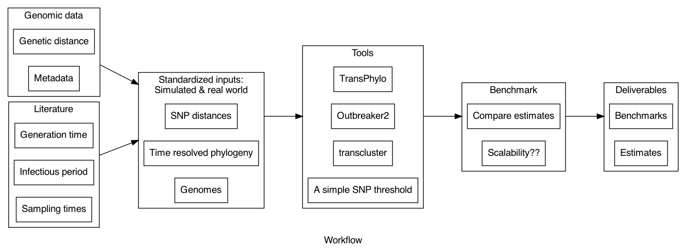

# Team 5: Estimating direct transmission in routine clinical sequencing from well sampled locations

List of participants and affiliations:
- Abhishek Mishra
- Ashwin Babu
- Chrispin Chaguza
- Joshua Levy
- Karthik G
- Lax Iyer
- Tyler Chefin
- Xiaopeng Bian

## Project Goals

* Benchmark three existing tools and include a simple SNP threshold as a baseline
    * Create simulated dataset and curate real world dataset.
    * Run tools on both datasets.
    * Compare estimates across tools for both datasets.
    * Identify a tool(s) based on estimates and scalability.
* Run selected tool(s) on dataset from a single well sampled location
* Visualize estimates 
## Approach

We selected three well-used tools to be part of our benchmarking analysis: [TransPhylo](https://github.com/xavierdidelot/TransPhylo), [outbreaker2](https://github.com/reconhub/outbreaker2), and [transcluster](https://github.com/JamesStimson/transcluster). We will include a simple SNP threshold to identify transmission clusters as a baseline. 

We simulated an outbreak using TransPhylo and simulated sequences from the resulting phylogenetic tree using [phastsim](https://github.com/NicolaDM/phastSim). For a real world dataset, we used all the sequences from Massachusetts, USA from the form of July 2010 from GISAID. This time period covers a well characterized superspreading event [(Ref)](https://www.sciencedirect.com/science/article/pii/S0092867421014902). 

## Results

## Future Work
